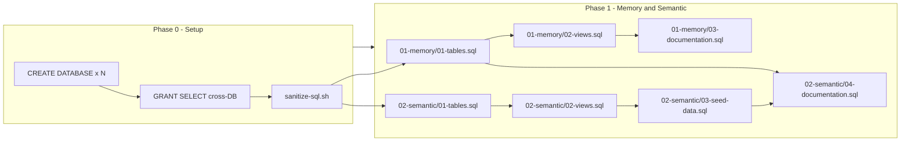
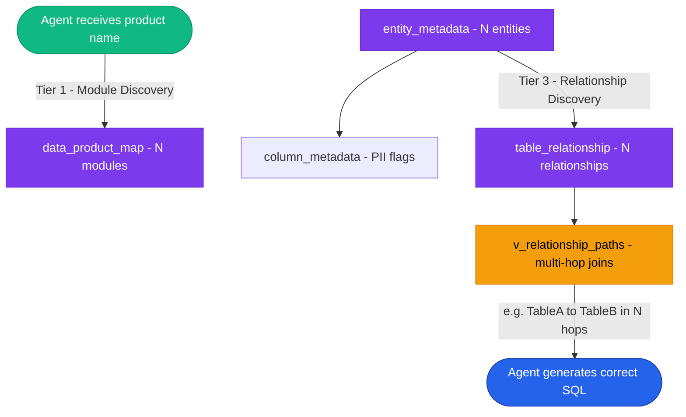

# {{ProductName}} Data Product -- Build Process Analysis

**Date**: {{date}}
**Built by**: {{agent_model}} via {{tool}}
**Duration**: {{duration}}
**Target**: {{teradata_version}}

---

## 1. Project Summary

{{one_paragraph_summary}}

### What was delivered

| Artifact | Count | Details |
|----------|-------|---------|
| Teradata databases | {{n}} | {{database_names}} |
| SQL files | {{n}} | Tables, views, indexes, seed data, feature load, documentation |
| Domain entities | {{n}} | {{entity_list_with_counts}} |
| Reference tables | {{n}} | {{ref_table_list}} |
| Engineered features | {{n}} | {{feature_list}} |
| Views | {{n}} | {{view_summary}} |
| Secondary indexes | {{n}} | {{index_summary}} |
| Documentation records | {{n}} | Module_Registry, Design_Decision, Business_Glossary, Query_Cookbook, Change_Log |
| Semantic registrations | {{entity_count}} entities, {{rel_count}} relationships, {{naming_count}} naming standards, {{col_count}} column metadata |

---

## 2. Architecture and Flow Diagrams

### 2.1 Agent Orchestration Graph

Shows which agent invoked which skills, and which tools each skill/phase used. Edges are labeled with invocation counts. Dashed lines indicate skills that were **not explicitly invoked** (see note below).

> **"Invoked" vs "Applied implicitly"**
>
> In this agentic framework, a **skill** is a structured prompt that gets loaded into the agent's context window when explicitly invoked (e.g., `/data-product-build`). The skill prompt contains specific rules, checklists, and conventions that the agent then follows precisely.
>
> If any skills were referenced by the build orchestrator but not explicitly loaded, note them here with dashed lines. Explain the impact -- did the agent miss rules that would have prevented errors?

<!-- Mermaid syntax rules for this template:
  1. Subgraph IDs must be simple identifiers (no spaces/colons). Use: subgraph P0[Phase 0 - Setup]
  2. Edge labels must have NO space between arrow and pipe: -->|label| NOT --> |label|
  3. Node labels must not contain special chars like !! or unescaped quotes
  4. Keep edge labels short and avoid colons inside labels
-->

```mermaid
graph TD
    USER([User]) -->|1 request| AGENT[agent_model]

    AGENT -->|invoked x1| SKILL_BUILD[/data-product-build]
    %% Add solid lines for skills that WERE invoked:
    %% AGENT -->|invoked xN| SKILL_X[/skill-name]
    %% Add dashed lines for skills that were NOT invoked:
    %% AGENT -.->|NOT invoked| SKILL_Y[/skill-name]

    SKILL_BUILD --> PHASE0[Discovery]
    SKILL_BUILD --> PHASE_GEN[SQL Generation]
    SKILL_BUILD --> PHASE_DEP[Deployment]
    SKILL_BUILD --> PHASE_DOC[Documentation]

    %% Connect phases to tools with approximate call counts:
    %% PHASE0 -->|~N calls| TOOL_NAME[(Tool)]

    %% Style invoked skills solid blue, non-invoked dashed grey:
    style SKILL_BUILD fill:#2563eb,color:#fff,stroke:#1e40af
    %% style SKILL_Y fill:#94a3b8,color:#fff,stroke:#64748b,stroke-dasharray: 5 5
```

### 2.2 Deployment Sequence (Phased)

Shows the strict phase ordering, file dependencies, and where errors occurred (if any). Mark errors with red nodes.



### 2.3 Data Lineage: Source to Features

Shows how raw source data flows through Domain entities into engineered Prediction features (if applicable).


### 2.4 Semantic Discovery Graph

Shows how an agent navigates the data product via the Semantic module's three-tier discovery hierarchy.



---

## 3. Call Flow: Skills and Tools

### Skill Invocations

| Skill | Invoked? | Times | Notes |
|-------|----------|-------|-------|
| `/data-product-build` | YES | 1 | Orchestrator -- loaded at start |
| `/teradata-sql` | {{YES/NO}} | {{n}} | {{notes}} |
| `/teradata-query` | {{YES/NO}} | {{n}} | {{notes}} |
| `/data-product-design` | {{YES/NO}} | {{n}} | {{notes}} |

### Tool Usage Summary

| Tool | Invocations | Purpose |
|------|-------------|---------|
| **Bash (tq query)** | {{n}} | Database exploration, SQL deployment, validation queries |
| **Write** | {{n}} | Creating SQL files |
| **Read** | {{n}} | Design standards, existing project files |
| **Edit** | {{n}} | Fixing SQL bugs, updating skills |
| **Glob** | {{n}} | Finding files |
| **Grep** | {{n}} | Searching content |
| **TaskCreate/Update** | {{n}} | Progress tracking |

### Detailed Call Flow

Document the step-by-step sequence of tool calls, grouped by phase. Use the ASCII tree format:

```
User Request
  |
  v
[Skill: data-product-build]
  |
  |-- PHASE 0: DISCOVERY & PLANNING
  |     |-- [Tool] Action taken
  |     \-- [Tool] Action taken
  |
  |-- PHASE 1: MEMORY + SEMANTIC (SQL Generation)
  |     |-- [Write] file.sql
  |     \-- ...
  |
  |-- DEPLOYMENT
  |     |-- [Bash/tq] file.sql (N statements OK)
  |     |     \-- FAILURE: description
  |     |     \-- FIX: [Edit] what was changed
  |     |     \-- RETRY -- OK
  |     \-- ...
  |
  \-- DOCUMENTATION & SKILL UPDATES
        |-- [Write/Edit] doc files
        \-- [Edit] skill files (if lessons learned)
```

---

## 4. Errors Encountered and Resolution

| # | Error | Root Cause | Fix | Preventable? | Codified in Skill? |
|---|-------|------------|-----|-------------|-------------------|
| {{n}} | {{error_msg}} | {{root_cause}} | {{fix}} | {{YES/NO}} | {{skill_name or N/A}} |

---

## 5. Process Timeline

```
DISCOVERY & PLANNING     {{bar}}  ~{{pct}}%
  {{description}}

SQL GENERATION            {{bar}}  ~{{pct}}%
  {{description}}

DEPLOYMENT & FIXES        {{bar}}  ~{{pct}}%
  {{description}}

DOCUMENTATION             {{bar}}  ~{{pct}}%
  {{description}}

SKILL OPTIMIZATION        {{bar}}  ~{{pct}}%
  {{description}}
```

---

## 6. Improvement Opportunities

For each observation, document:

- **Observation**: What happened or what was noticed
- **Impact**: How it affected the build (time, errors, quality)
- **Recommendation**: Concrete action to improve future builds

Focus on process and tooling improvements, not data logic (which changes per product).
